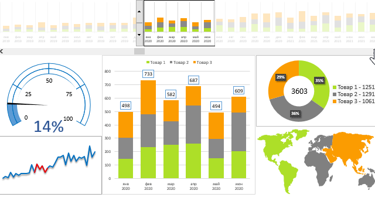

<!-- Ваша главная приветственная гифка (aa.gif) -->

---

## 📑 Обо мне

Я практикующий аналитик данных. Имею успешный опыт работы в формате начинающего аналитика в поддержке, консалтинга и фриланса, где самостоятельно веду проекты от брифования заказчика до сдачи готовых интерактивных решений руководству компании (CEO).

* **Мой подход к работе:** я не просто строю графики, а перевожу сложные массивы сырых данных на понятный язык бизнес-метрик. Помогаю находить точки роста, оптимизировать процессы и прозрачный контроль KPI в реальном времени.
## 🛠️ Мой технологический стек

* **Языки программирования & Анализ:** Python (Pandas, NumPy), SQL
* **Оркестрация & ETL:** Apache Airflow, Git, GitLab CI/CD
* **Базы данных & Хранилища:** PostgreSQL, ClickHouse
* **Визуализация (BI):** Tableau, Power BI, Yandex DataLens

---

## 📈 Коммерческие проекты (Фриланс / Консалтинг)

<table>
  <!-- ПРОЕКТ 1: ТКО -->
  <tr>
    <td>
      <h3>🚛 Проект 1: Дашборд мониторинга качества вывоза ТКО и соблюдения SLA подрядчиками</h3>
      
<b>Стек:</b> <code>Python</code> <code>Pandas</code> <code>SQL</code> <code>Apache Airflow</code> <code>Yandex DataLens</code> <code>GeoJSON</code>

      <ul>
        <li><b>Загрузка и ETL:</b> Разработала автоматический скрипт на Python для сбора и предобработки сырых логов логистики мусороуборочной техники и фактических отметок с датчиков.</li>
        <li><b>Автоматизация (Airflow):</b> Настроила DAG в Apache Airflow для ежедневного автоматического обновления данных, очистки дублей и пересчета метрик по расписанию.</li>
        <li><b>Гео-аналитика и Data Blending:</b> Провела гео-обогащение данных: связала текстовые адреса площадок с географическими координатами для корректного маппинга.</li>
        <li><b>Расчет SLA:</b> Реализовала логику расчета метрик SLA (доля просроченных выездов, среднее время задержки, топ проблемных адресов).</li>
        <li><b>🎯 Результат:</b> Обеспечила прозрачность логистики для заказчиков, предоставив инструмент контроля сбоев в реальном времени, что позволило снизить количество жалоб жителей на 25%.</li>
      </ul>
      <!-- Код для вашей будущей гифки по ТКО -->
      <!--  -->
    </td>
  </tr>
  
  <!-- ПРОЕКТ 2: БЬЮТИ -->
  <tr>
    <td>
      <h3>💄 Проект 2: Анализ эффективности ассортиментной матрицы бьюти-товаров и контроль KPI выкупа</h3>
      
<b>Стек:</b> <code>Python</code> <code>Pandas</code> <code>SQL</code> <code>Tableau</code> <code>MS Excel</code>

      <ul>
        <li><b>Объединение таблиц (Data Blending):</b> Реализовала сбор и трансформацию данных из двух разнородных источников: транзакционной таблицы по товарам (цены, выручка) и исторической выгрузки финансовых метрик брендов.</li>
        <li><b>Предобработка данных:</b> Написала конвейер очистки данных на Python (Pandas) для нормализации категорий, подкатегорий и стран происхождения бьюти-товаров.</li>
        <li><b>Расчет операционных KPI:</b> Рассчитала ключевые метрики ритейла: выручку MoM (Month-on-Month), объем продаж в штуках, среднюю цену и процент выкупа (целевой ориентир — 95%).</li>
        <li><b>Бизнес-эффект:</b> Спроектировала систему срезов и фильтрации для глубокого факторного анализа эффективности контрактов с брендами.</li>
        <li><b>🎯 Результат:</b> Инструмент внедрен в регулярные бизнес-процессы (используется на созвонах с CEO) для принятия решений о выводе непопулярных SKU с низким спросом и запуске точечных маркетинговых акций.</li>
      </ul>
       
      
    </td>
  </tr>
</table>

---

## 🎓 Учебные проекты (Karpov.Courses)

<table>
  <!-- УЧЕБНЫЙ ПРОЕКТ 1 -->
  <tr>
    <td>
      <h3>🌪️ Автоматизация конвейера глобальной доменной аналитики в Apache Airflow</h3>
      
<b>Стек:</b> <code>Python</code> <code>Pandas</code> <code>Apache Airflow</code> <code>GitLab CI/CD</code>

      
Разработан кастомный ETL-процесс для автоматической обработки веб-аналитики. DAG по расписанию скачивает и распаковывает данные о миллионе самых популярных доменов в мире, выполняет параллельную фильтрацию по заданным региональным зонам (.ru, .com) методами Pandas и логирует итоговый топ-10. Реализован контроль исторических запусков (catchup=False).

      
👉 <a href="https://karpov.courses">Посмотреть код репозитория в GitLab</a>

    </td>
  </tr>

  <!-- УЧЕБНЫЙ ПРОЕКТ 2 (ЗАГОТОВКА) -->
  <tr>
    <td>
      <h3>📊 Проект 2: [Название следующего проекта, например: Анализ баз данных с помощью SQL]</h3>
      
<b>Стек:</b> <code>SQL</code> <code>PostgreSQL</code> <code>Визуализация</code>

      
[Краткое описание задачи, которую вы решите: например, написание сложных оконных функций, оптимизация запросов или когортный анализ для учебной базы данных].

      
👉 <i>Проект в процессе реализации / Ссылка появится скоро</i>

    </td>
  </tr>
</table>

---

